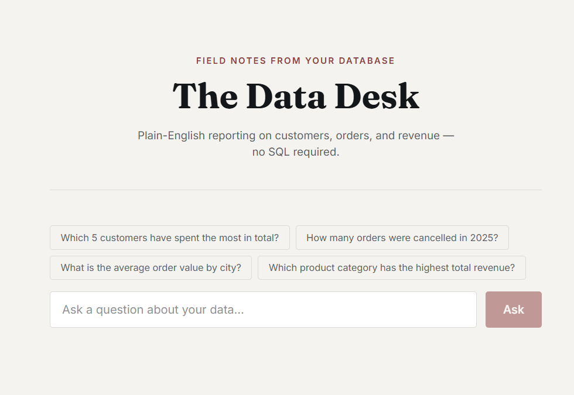
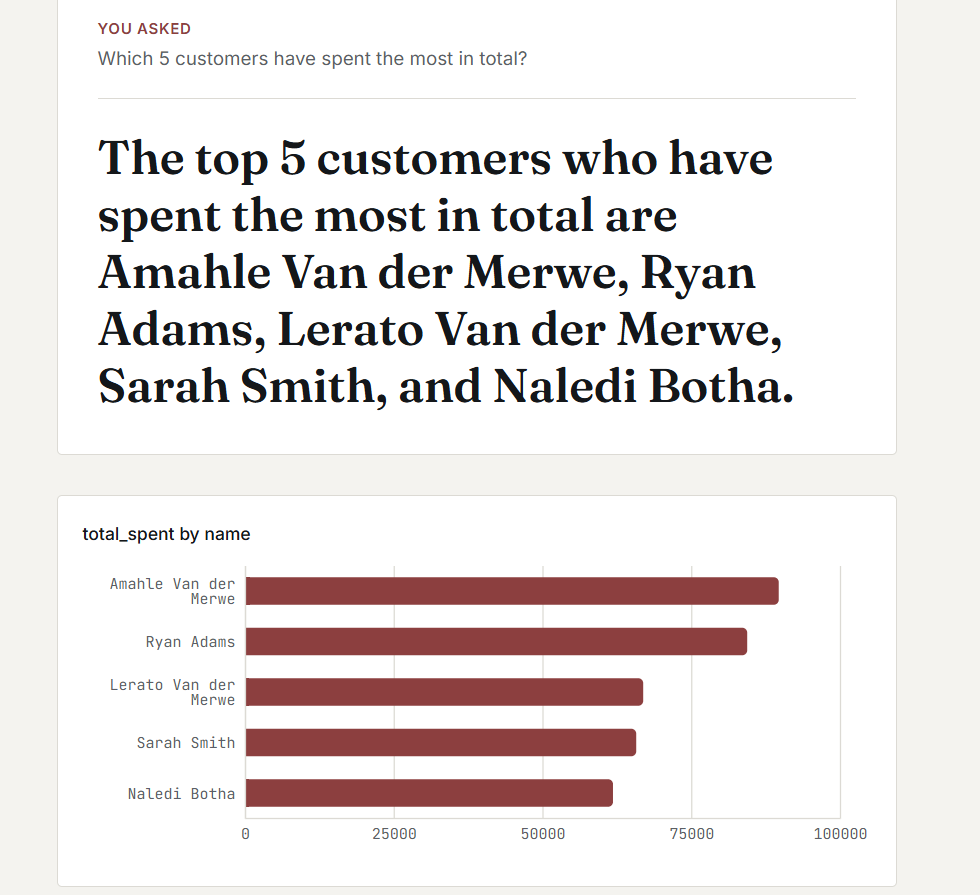
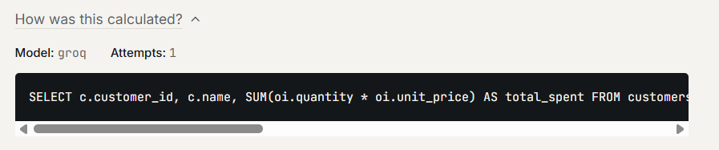

# Text-to-SQL Agent


Turns a plain-English question into SQL, validates it, runs it against a
sandboxed read-only database, and retries automatically on failure, built
entirely on free-tier LLM APIs (Groq primary, Gemini fallback). A React
frontend puts the answer in front of non-technical stakeholders as a written
finding, not a query result.

## Screenshots

| Landing | Answer + chart | SQL transparency |
|---|---|---|
|  |  |  |

## The scenario

To keep this a self-contained, reproducible demo rather than something tied
to another one of my projects, the agent runs against a **fully synthetic
e-commerce dataset**, not a real company. Picture a small direct-to-consumer
shop with customers across South African cities (Cape Town, Johannesburg,
Durban, Pretoria, Gqeberha, Bloemfontein), selling Electronics, Home, Books,
and Sports products. It exists purely so the agent has something realistic
and joinable to query. `scripts/seed_db.py` builds the whole thing from
scratch with `random.seed(42)`, so a fresh clone always reproduces the exact
same data, which is what makes the eval suite's scores repeatable.

## Why this exists

Most text-to-SQL demos are a single prompt-and-hope call. This one adds the
three things that separate an agent from a wrapper:

- **Schema-aware prompting.** Only relevant tables are retrieved and sent to
  the model, not the whole schema every time.
- **Validation before execution.** Generated SQL is parsed with `sqlglot`,
  restricted to `SELECT`-only, checked against known tables, and capped with
  a row limit, before it ever touches the database.
- **Self-correcting retry loop.** If validation or execution fails, the
  error is fed back to the model for up to 3 attempts.

## Architecture
question -> schema retrieval -> LLM (Groq/Gemini) -> SQL validator
-> read-only execution -> retry-on-error (up to 3x) -> result + NL summary

## Dataset

| Table | Rows | Notes |
|---|---|---|
| `customers` | 60 | name, email, city, signup date |
| `products` | 20 | 4 categories: Electronics, Home, Books, Sports |
| `orders` | ~194 | 0-6 per customer, Jan 2024 to Jul 2026, status weighted 10/20/60/10 (pending/shipped/delivered/cancelled) |
| `order_items` | ~510 | 1-4 line items per order, quantity 1-5, price locked at time of order |

Fully synthetic, generated by `scripts/seed_db.py`, deterministic via
`random.seed(42)`.

## Setup

```bash
git clone <your-repo-url>
cd text-to-sql-agent
python3 -m venv .venv && source .venv/bin/activate
pip install -r requirements.txt

cp .env.example .env
# add your free Groq key from https://console.groq.com
# (optional) add a free Gemini key from https://aistudio.google.com/apikey

python scripts/seed_db.py
```

## Run

API:
```bash
uvicorn app.main:app --reload
# POST http://localhost:8000/ask   {"question": "top 5 customers by spend"}
```

Web UI:
```bash
cd frontend
npm install
npm run dev
# open http://localhost:7173
```

## Evaluate

```bash
python -m eval.run_eval
```

Scores the agent against `eval/questions.json`, 14 hand-written questions
spanning simple lookups, aggregation, joins, ranking, time filters, and
deliberately unanswerable questions, to check the agent declines gracefully
instead of hallucinating. Scoring is by execution match (same result set),
not SQL text match, since there are many valid ways to write the same query.

## Design notes and tradeoffs

- **Free-tier only.** Groq is primary for speed; Gemini is the fallback if
  Groq errors or rate-limits. Swap providers by editing `LLMClient`.
- **Schema retrieval is keyword-overlap, not embeddings**, since 4 tables
  does not need a vector DB. If extended to a larger schema, swap
  `schema_store.py`'s `_score()` for `sentence-transformers` plus Chroma
  embeddings. The rest of the pipeline does not need to change.
- **SQLite read-only enforcement** uses a `mode=ro` file URI. For Postgres,
  replace this with a dedicated read-only DB role instead.

## Repo structure

├── app/
│   ├── core/              # Retrieval, LLM client, validator, executor, agent
│   └── main.py            # FastAPI entrypoint
├── frontend/              # React + Vite + Tailwind UI
├── data/                  # Schema and seeded database
├── eval/                  # Evaluation question set and runner
├── scripts/               # Database seeding scripts
└── requirements.txt       # Python dependencies


